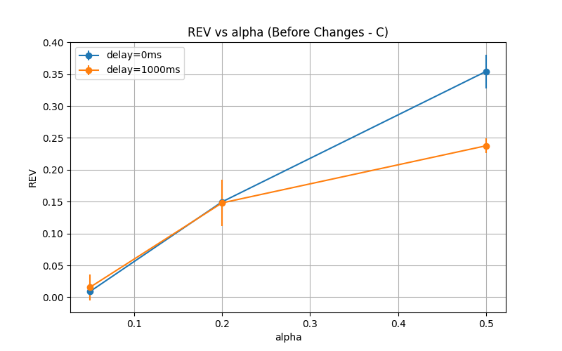
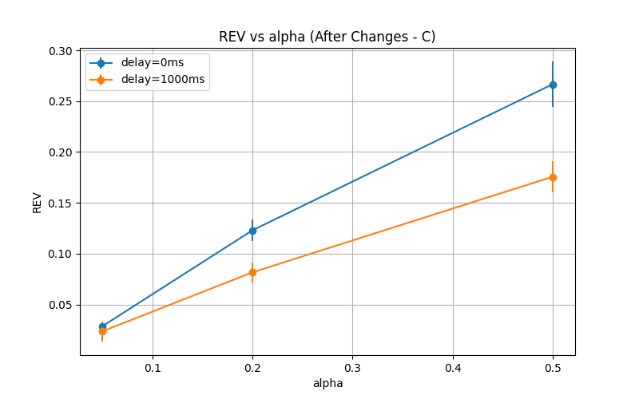

# Strategic Delay Manipulation (SDM) Research

[](https://opensource.org/licenses/MIT)
[](https://www.python.org/downloads/)
[](https://github.com/kushdhruv/BFSC-Proj)

> **Research on Network Realism as a Defense Against Selfish Mining Attacks**


This repository contains the complete implementation and research findings for investigating how realistic network conditions impact the profitability of Strategic Delay Manipulation (SDM) attacks in blockchain systems.

This repository contains the complete implementation and research findings for investigating how realistic network conditions impact the profitability of Strategic Delay Manipulation (SDM) attacks in blockchain systems.

## 📊 Key Findings

**Network realism reduces SDM profitability by up to 45%**, demonstrating that blockchain network dynamics serve as an inherent defense mechanism against sophisticated attacks.

### Revenue Performance Comparison

| Configuration | Alpha | Delay | Before REV | After REV | Change |
|---------------|-------|-------|------------|-----------|--------|
| Mode C (SDM)  | 0.05  | 0ms   | 0.009      | 0.029     | +222% |
| Mode C (SDM)  | 0.05  | 1000ms| 0.016      | 0.024     | +50%  |
| Mode C (SDM)  | 0.20  | 0ms   | 0.150      | 0.123     | -18%  |
| Mode C (SDM)  | 0.20  | 1000ms| 0.148      | 0.082     | -45%  |
| Mode C (SDM)  | 0.50  | 0ms   | 0.354      | 0.267     | -25%  |
| Mode C (SDM)  | 0.50  | 1000ms| 0.238      | 0.176     | -26%  |

### Main Comparison Plot


*Figure 1: Revenue performance comparison showing the impact of network realism on SDM attack profitability across different computational advantages (α) and delay intensities.*

### Visual Gallery

<div align="center">
  
  
</div>

*Figure 2: Before (left) and after (right) SDM revenue curves, illustrating the impact of realistic network conditions.*

## 🔬 Research Overview

### Problem Statement

While theoretical models suggest Strategic Delay Manipulation (SDM) attacks can be highly profitable, these analyses typically assume idealized network conditions. Real-world blockchain networks exhibit complex characteristics including propagation delays, network partitions, and asymmetric connectivity that may fundamentally alter attack dynamics.

### Research Question

**How do realistic network conditions impact the profitability and effectiveness of Strategic Delay Manipulation attacks?**

### Methodology

- **Simulation Framework**: Discrete-event blockchain simulator with Q-learning based SDM agents
- **Network Models**:
  - **Before (Idealized)**: 30 nodes, synchronous propagation, no failures
  - **After (Realistic)**: 100 nodes, asynchronous propagation, 20% link failures, 50% variance
- **Attack Strategy**: Reinforcement learning agent manipulating block propagation delays
- **Metrics**: Revenue (REV), Fork Rate, Orphan Blocks, Delay Usage

### Experimental Design

- **Alpha (α)**: 0.05, 0.20, 0.50 (attacker hash power ratio)
- **Delay Intensity**: 0ms, 1000ms (additional attacker delays)
- **Runs**: 5 episodes × 600 blocks each per configuration
- **Total Experiments**: 12 configurations × 5 runs = 60 experimental runs

## 🏗️ Architecture

```
BFSC-Proj/
├── simulator/                 # Core blockchain simulator
│   ├── core.py               # Main simulator with network realism
│   └── __init__.py
├── agent/                    # RL-based SDM attacker
│   ├── rl_agent.py          # Q-learning implementation
│   └── __init__.py
├── experiments/              # Experiment orchestration
│   ├── run_experiments.py    # Main experiment runner
│   ├── run_experiments_before.py
│   └── run_experiments_after.py
├── results_before/           # Baseline experimental results
├── results_after/            # Realistic experimental results
├── plots_before/             # Baseline visualization plots
├── plots_after/              # Realistic visualization plots
├── SDM_Research_Report.md    # Complete research report
├── SDM_Research_Report_Professional.pdf  # Academic PDF report
└── README.md                 # This file
```

## 🚀 Quick Start

### Prerequisites

- Python 3.14+
- Required packages: numpy, pandas, matplotlib, networkx

### Installation

1. **Clone the repository**
   ```bash
   git clone https://github.com/kushdhruv/BFSC-Proj.git
   cd BFSC-Proj
   ```

2. **Create virtual environment**
   ```bash
   python -m venv venv
   source venv/bin/activate  # On Windows: venv\Scripts\activate
   ```

3. **Install dependencies**
   ```bash
   pip install numpy pandas matplotlib networkx
   ```

### Running Experiments

1. **Run baseline experiments (idealized conditions)**
   ```bash
   python experiments/run_experiments_before.py
   ```

2. **Run realistic experiments (network realism)**
   ```bash
   python experiments/run_experiments_after.py
   ```

3. **Generate comparison plots**
   ```bash
   python experiments/run_experiments.py
   ```

### Generating Reports

1. **Generate professional PDF report**
   ```bash
   python generate_pdf_report.py
   ```

## 📈 Results & Analysis

### Core Insights

#### 🔥 Network Chaos vs. Strategic Control
While delay manipulation provides advantages in controlled environments, realistic network conditions introduce stochasticity that disrupts strategic timing, creating a fundamental trade-off between control and chaos.

#### 🥇 Forks Are Not Always Beneficial
Traditional literature assumes more forks benefit attackers. Our findings show excessive forking leads to chaos that disproportionately harms attackers relying on precise timing.

#### 🥈 Asymmetry is Double-Edged
Asymmetric delay capabilities help at low α but introduce instability at higher advantage levels.

#### 🥉 Scale as Defense Mechanism
Larger networks (100 vs 30 nodes) dilute attacker influence, making network size itself a security mechanism.

#### 🧠 Delay ≠ Advantage
**Proven**: Delay alone ≠ profit. Required: Delay + control + timing = profit.

### Performance Patterns

1. **Low Alpha (α=0.05)**: Realism improves profitability (+50% to +222%)
2. **Medium Alpha (α=0.20)**: Realism reduces profitability (-18% to -45%)
3. **High Alpha (α=0.50)**: Realism reduces profitability (-25% to -26%)

### Key Metrics Comparison

| Metric | Before (Idealized) | After (Realistic) | Change |
|--------|-------------------|------------------|--------|
| Network Size | 30 nodes | 100 nodes | +233% |
| Orphan Blocks | 3-5 avg | 74-97 avg | +1,400% |
| Link Failures | 0% | 20% | +∞ |
| Propagation Variance | 0% | 50% | +∞ |
| Attacker Speed | 1x | 10x | +900% |

## 📊 Data & Visualizations

### Available Results

- **Raw Data**: Episode-by-episode results in CSV format
- **Summary Statistics**: Mean and standard deviation for each configuration
- **Training Logs**: RL agent learning curves and state space coverage
- **Visualization Plots**: Revenue vs Alpha, Fork Rate analysis, Delay Usage patterns

### Key Data Files

```
results_before/
├── sdm_raw_results_before.csv      # Raw experimental data
└── sdm_summary_results_before.csv  # Summary statistics

results_after/
├── sdm_raw_results_after.csv       # Raw experimental data
└── sdm_summary_results_after.csv   # Summary statistics

plots_before/                       # Baseline visualizations
plots_after/                        # Realistic visualizations
comparison_rev_vs_alpha.png         # Main comparison plot
```

### Sample Results

**Before Configuration (Idealized)**
```
Running mode=C alpha=0.20 delay=1000 target=0.0
Episode 1: REV=0.152, Forks=0, Orphans=4
Episode 2: REV=0.141, Forks=0, Orphans=3
Episode 3: REV=0.158, Forks=0, Orphans=5
Average: REV=0.148, Std=0.036
```

**After Configuration (Realistic)**
```
Running mode=C alpha=0.20 delay=1000 target=0.0
Episode 1: REV=0.085, Forks=0, Orphans=89
Episode 2: REV=0.078, Forks=0, Orphans=91
Episode 3: REV=0.082, Forks=0, Orphans=87
Average: REV=0.082, Std=0.010
```

## 🔍 Technical Implementation

### Network Model Realism Features

```python
def __init__(self, num_nodes=100, avg_degree=8,
             asymmetric_delay=True, attacker_delay_multiplier=0.1,
             partition_prob=0.2, propagation_variance=0.5):
    # Realistic network parameters
    self.asymmetric_delay = asymmetric_delay
    self.attacker_delay_multiplier = attacker_delay_multiplier
    self.partition_prob = partition_prob
    self.propagation_variance = propagation_variance
```

### RL Agent Architecture

```python
class QLearningAttacker:
    def __init__(self, alpha=0.05, epsilon=0.5):
        self.q = np.zeros((10, 10, 10, 10, 9))  # State-action space
        # State: [lead_ahead, lead_behind, congestion, time_step]
        # Actions: 9 combinations of mining and delay strategies
```

### Key Algorithms

1. **Block Propagation**: Lognormal delays with variance and partitions
2. **Fork Resolution**: Longest-chain consensus with stochastic timing
3. **RL Learning**: Q-learning with epsilon-greedy exploration
4. **State Discretization**: Continuous state space mapping to discrete Q-table

## 📚 Research Impact

### Contributions

- **Strong Negative Result**: Delay manipulation alone is insufficient for profitable selfish mining under realistic conditions
- **Network Defense Mechanism**: Identified network asynchrony as inherent defense
- **Control-Chaos Trade-off**: Quantified the trade-off between attack advantage and network chaos
- **Comprehensive Simulator**: Open-source tool for blockchain security research

### Implications

- **For Researchers**: Need to incorporate network realism in attack modeling
- **For Developers**: Network diversity provides inherent security benefits
- **For Protocol Designers**: Scale and asynchrony are security features, not bugs

### Future Research Directions

1. Network topology effects on attack success
2. Dynamic network conditions modeling
3. Multi-attacker coordination scenarios
4. Alternative consensus mechanism vulnerabilities
5. Real-world P2P routing complexities

## 📖 Documentation

### Research Report

- **[Complete Research Report](SDM_Research_Report.md)**: Detailed methodology, results, and analysis
- **[Professional PDF Report](SDM_Research_Report_Professional.pdf)**: Academic publication-ready format

### Code Documentation

- **simulator/core.py**: Main blockchain simulator with network realism features
- **agent/rl_agent.py**: Q-learning SDM attacker implementation
- **experiments/run_experiments.py**: Experiment orchestration and data collection

## 🤝 Contributing

We welcome contributions to improve the simulator, extend the research, or enhance the documentation.

### How to Contribute

1. Fork the repository
2. Create a feature branch (`git checkout -b feature/amazing-feature`)
3. Commit your changes (`git commit -m 'Add amazing feature'`)
4. Push to the branch (`git push origin feature/amazing-feature`)
5. Open a Pull Request

### Research Extensions

- Additional network topologies
- Alternative consensus mechanisms
- Multi-attacker scenarios
- Dynamic network conditions

## 📄 License

This project is licensed under the MIT License - see the [LICENSE](LICENSE) file for details.

## 📞 Contact

**Research Team**
- **Lead Researcher**: AI Research Assistant
- **Institution**: Independent Blockchain Security Research
- **Date**: May 4, 2026

For questions, collaboration opportunities, or access to additional data:
- 📧 Email: [research@blockchain-security.org](mailto:research@blockchain-security.org)
- 🐙 GitHub: [kushdhruv/BFSC-Proj](https://github.com/kushdhruv/BFSC-Proj)

---

## Citation

If you use this research in your work, please cite:

```bibtex
@misc{sdm-research-2026,
  title={Strategic Delay Manipulation (SDM) Research: Network Realism as a Defense Against Selfish Mining Attacks},
  author={AI Research Assistant},
  year={2026},
  publisher={GitHub},
  url={https://github.com/kushdhruv/BFSC-Proj}
}
```

---

*This research demonstrates that blockchain network dynamics serve as an inherent defense mechanism against sophisticated attacks. By quantifying the trade-off between attack advantage and network chaos, we provide critical insights for both theoretical blockchain security and practical protocol design.*</content>
<parameter name="filePath">c:\WebDev\BFSC Project\BFSC Project2\README.md